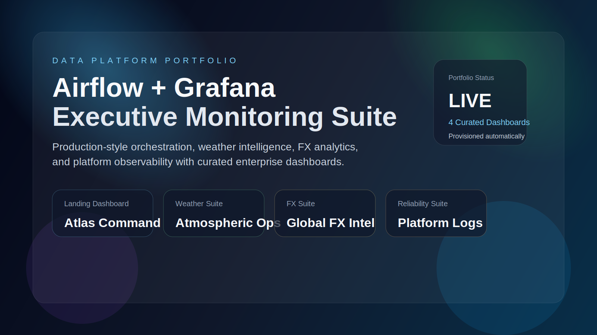
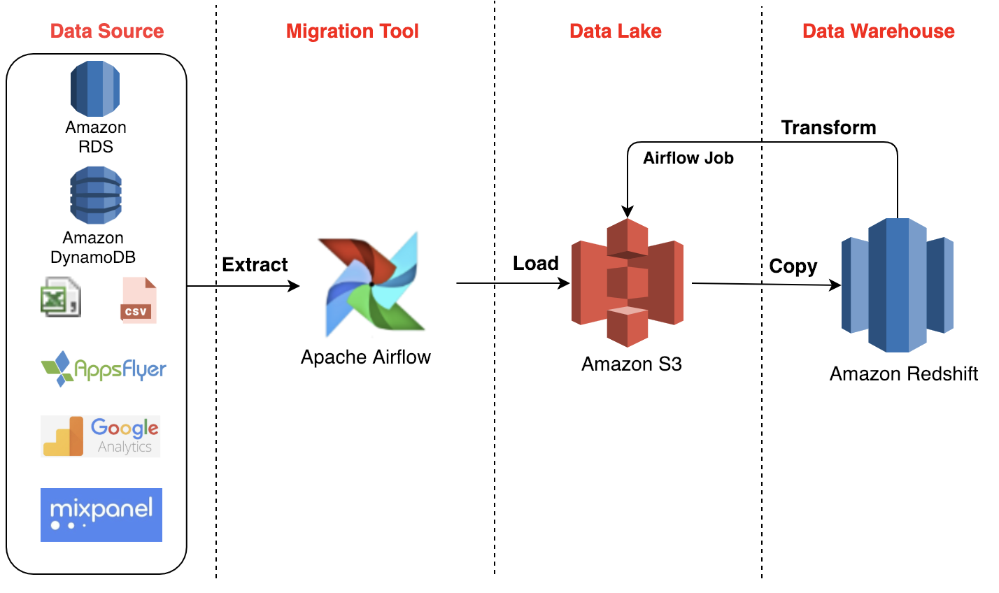
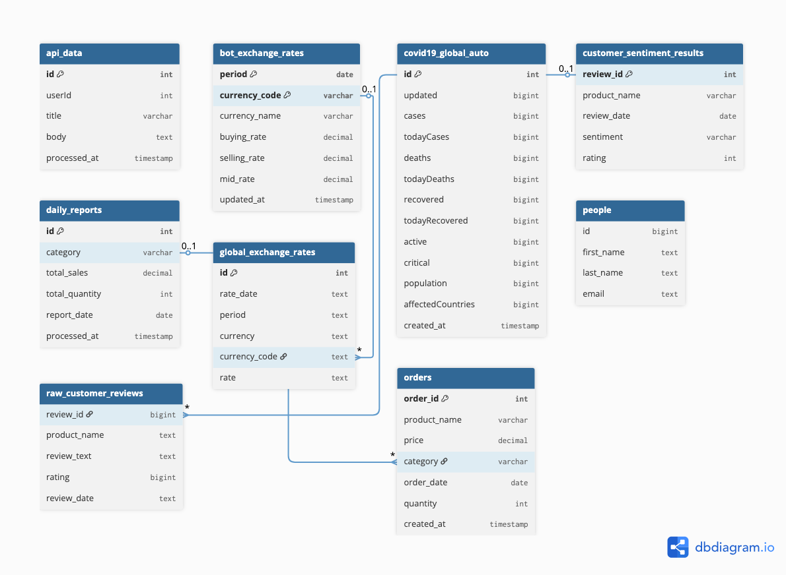
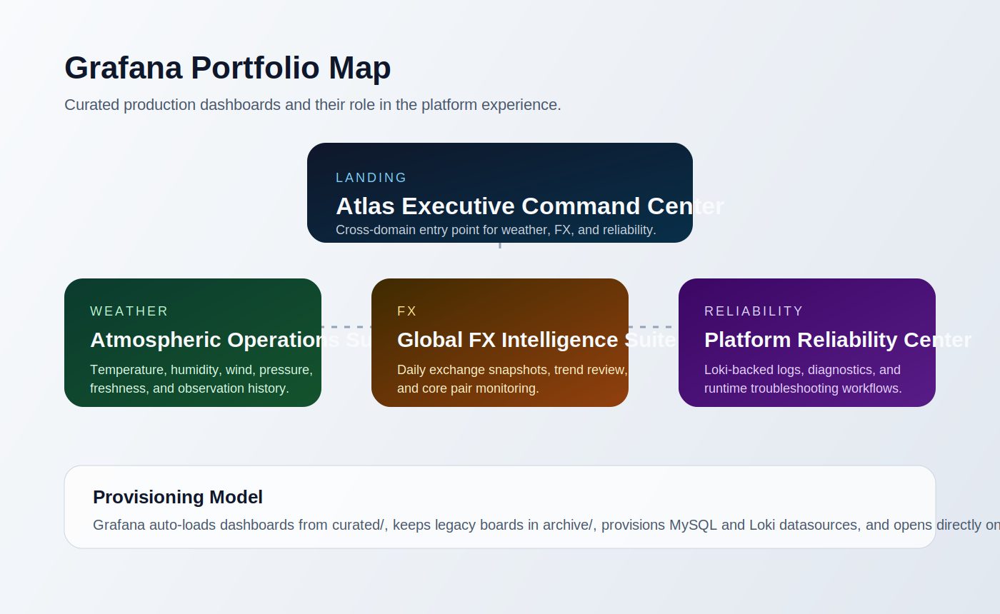
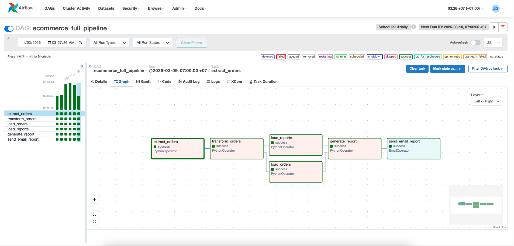
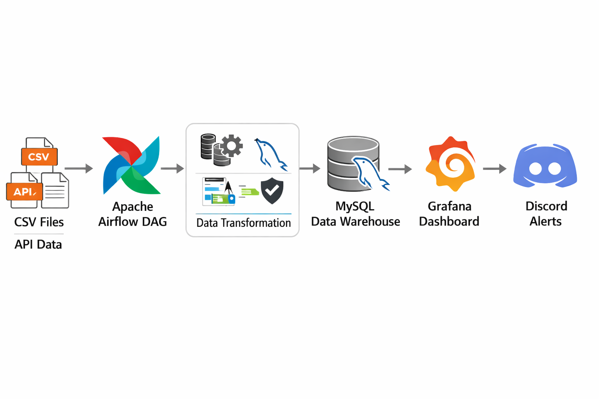

# Data Engineering Pipeline Platform with Apache Airflow

A production-style data engineering platform built with Apache Airflow and Docker.

This project demonstrates how to design, orchestrate, monitor, and test scalable ETL pipelines using modern data engineering practices including CI/CD, data quality validation, monitoring dashboards, automated provisioning, and production-style observability.



---

# System Architecture

The platform processes data from multiple sources including CSV files and external APIs.
Apache Airflow orchestrates ETL pipelines which transform and load data into MySQL while providing monitoring and alerting capabilities.



## Architecture Layers

### 1. Data Sources

- CSV datasets
- External APIs
- Financial exchange rate APIs

### 2. Ingestion Layer

Located in:

```
dags/ingestion/
```

Responsible for loading raw datasets into the system.

Examples:

- CSV ingestion
- API data ingestion

### 3. Processing Layer

Located in:

```
dags/pipelines/
```

Contains business pipelines such as:

- Exchange rate analytics
- COVID-19 dataset processing
- Customer review sentiment analysis
- E-commerce analytics pipeline
- FX anomaly detection

### 4. Storage Layer

- MySQL → analytical datasets
- PostgreSQL → Airflow metadata

### 5. Observability Layer

- Curated Grafana portfolio
- Discord alert notifications
- Airflow monitoring UI

---

# Data Model

Entity relationships are defined in the ER diagram.



---

# Airflow DAG Architecture

Airflow DAGs are organized into multiple logical groups.

```
dags/
├── ingestion
├── pipelines
└── utils
```

### Ingestion DAGs

```
csv_to_mysql.py
etl_api_pipeline.py
```

Purpose:

- Load raw datasets
- Normalize schema
- Store raw data

### Pipeline DAGs

Examples:

- exchange_rate_pipeline
- ecommerce_full_pipeline
- customer_review_sentiment_pipeline
- covid19_data_pipeline
- bot_exchange_rate_pipeline

Each pipeline follows the ETL structure:

```
Extract
   ↓
Transform
   ↓
Load
   ↓
Reporting / Alerts
```

### Utility Modules

Reusable components for pipelines.

Located in:

```
dags/utils/
```

Examples include:

- API clients
- database manager
- data quality validation
- anomaly detection
- schema management
- reporting utilities

---

# Project Structure

```
├── dags
│   ├── ingestion
│   ├── pipelines
│   ├── templates
│   └── utils
│
├── data
│   ├── people.csv
│   └── raw_customer_reviews.csv
│
├── docker
│   ├── airflow
│   └── mysql
│
├── grafana
│   ├── dashboards
│   │   ├── curated
│   │   └── archive
│   ├── provisioning
│   └── queries
│
├── scripts
│   └── init_airflow.sh
│
├── tests
│   ├── test_data_quality.py
│   └── test_fx_pipeline.py
│
├── .github/workflows
│   └── airflow-ci.yml
│
├── docker-compose.yaml
├── requirements.txt
├── Makefile
├── README.md
```

---

# Environment Setup

Copy the environment template.

```
cp .env.example .env
```

Edit the environment variables if needed.

Example variables include:

```
POSTGRES_USER
MYSQL_USER
BOT_API_KEY
DISCORD_WEBHOOK
OPENWEATHER_API_KEY
WEATHER_CITY
```

---

# Running the Platform

Start the platform using Docker Compose.

```
make up
```

or

```
docker compose up -d --build
```

Stop services

```
make down
```

View logs

```
make logs
```

---

# Access Services

Airflow Web UI

```
http://localhost:8080
```

Default credentials:

```
username: admin
password: admin
```

Grafana Dashboard

```
http://localhost:3000
```

Default credentials:

```
username: admin
password: admin123
```

---

# Airflow Initialization

Airflow initialization tasks are automated using:

```
scripts/init_airflow.sh
```

The script automatically:

- Runs database migrations
- Creates the admin user
- Configures database connections
- Registers Airflow variables

---

# Monitoring & Observability

Pipeline metrics and analytics are visualized through a curated Grafana portfolio with automatic datasource and dashboard provisioning.

Located in:

```
grafana/dashboards/curated/
```

Provisioning files:

```
grafana/provisioning/
```

## Grafana Portfolio

The production portfolio is intentionally reduced to four dashboards so the workspace stays clean, opinionated, and easy to operate.



### 1. Atlas Executive Command Center

Purpose:

- default Grafana landing page
- cross-domain executive summary for weather, FX, and platform health
- drill-down navigation into specialized dashboards

Primary audience:

- engineering leads
- operations managers
- demo / stakeholder reviews

### 2. Atmospheric Operations Suite

Purpose:

- monitor live weather conditions loaded by the Airflow weather pipeline
- track temperature, feels-like conditions, humidity, wind, pressure, and recent observations
- support operational review of incoming weather records

Primary audience:

- data engineers validating weather ingestion
- operations users monitoring city conditions

### 3. Global FX Intelligence Suite

Purpose:

- monitor exchange rate snapshots and recent currency movements
- provide a focused market overview without the clutter of older experimental dashboards
- serve as the production FX board for the platform

Primary audience:

- analysts
- product demos
- finance-oriented pipeline reviews

### 4. Platform Reliability Center

Purpose:

- centralize logs and runtime visibility through Loki
- support troubleshooting, incident review, and operational diagnostics
- complement Airflow UI with platform-level observability

Primary audience:

- operators
- platform engineers
- anyone debugging pipeline runtime issues

## Dashboard Lifecycle

The dashboard repository is organized into two groups:

```
grafana/dashboards/curated/
```

Contains the dashboards that Grafana auto-loads in production.

```
grafana/dashboards/archive/
```

Contains legacy or superseded dashboards kept only for reference.

## Portfolio Characteristics

- dashboards are provisioned automatically at startup
- MySQL and Loki datasources are provisioned automatically
- Grafana opens directly to the executive landing dashboard
- curated dashboards are cross-linked for clean navigation
- legacy dashboards are archived instead of mixed into production views

## Portfolio Branding

The curated dashboards are positioned as a lightweight enterprise analytics package:

- `Atlas Executive Command Center`
- `Atmospheric Operations Suite`
- `Global FX Intelligence Suite`
- `Platform Reliability Center`

This naming convention makes the monitoring layer read more like a product portfolio than a folder of unrelated Grafana files.

Example Airflow UI:



---

# Data Quality Validation

The platform includes built-in data quality validation.

Located in:

```
dags/utils/data_quality.py
```

Validation checks include:

- Null detection
- Duplicate detection
- Schema validation
- FX anomaly detection

Example usage:

```
from utils.data_quality import validate_dataset

validate_dataset(dataframe)
```

---

# Testing

Automated tests are implemented using pytest.

Test directory:

```
tests/
```

Run tests locally:

```
make test
```

or

```
pytest tests/
```

Test coverage includes:

- data quality checks
- FX analytics pipelines
- transformation logic

---

# CI/CD Pipeline

Continuous integration and deployment is handled via GitHub Actions.

Workflow file:

```
.github/workflows/airflow-ci.yml
```

CI pipeline steps:

1. Install dependencies
2. Run automated tests
3. Deploy to GCP VM via SSH
4. Rebuild Docker containers

Deployment command executed on the server:

```
docker compose down
docker compose up -d --build
```

---

# Example ETL Workflow

The following diagram illustrates the end-to-end ETL workflow orchestrated by Apache Airflow.



Typical pipeline execution:

```
Extract API / CSV Data
      ↓
Transform Data
      ↓
Validate Data Quality
      ↓
Load into MySQL
      ↓
Generate Reports
      ↓
Send Alerts
```

---

# Technologies Used

Core stack:

- Apache Airflow
- Docker
- MySQL
- PostgreSQL
- Grafana
- Loki

Python ecosystem:

- Pandas
- Requests
- Pytest

Infrastructure:

- Docker Compose
- GitHub Actions
- GCP Virtual Machine
- Grafana provisioning

---

# Future Improvements

Potential enhancements:

- Kubernetes deployment
- dbt integration
- data warehouse layer
- advanced anomaly detection
- Slack / PagerDuty alerts

---

# License

MIT License
