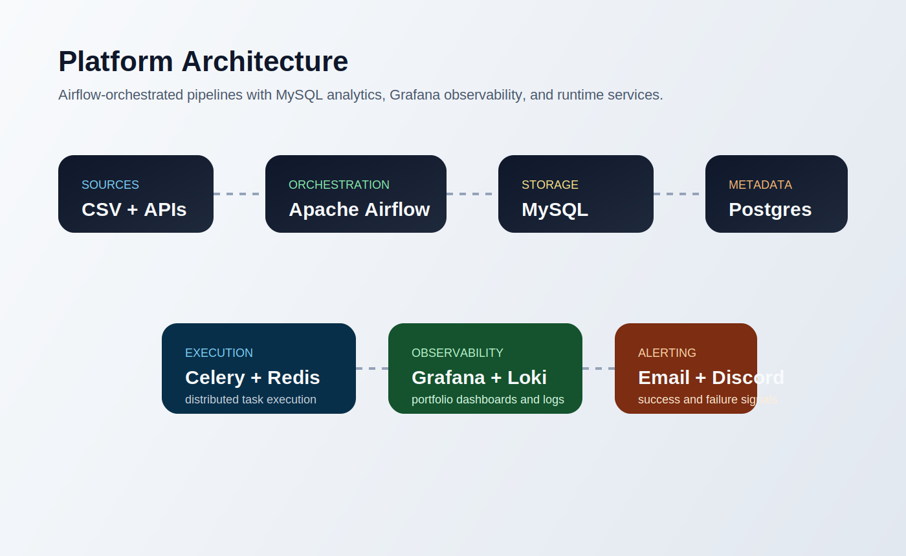
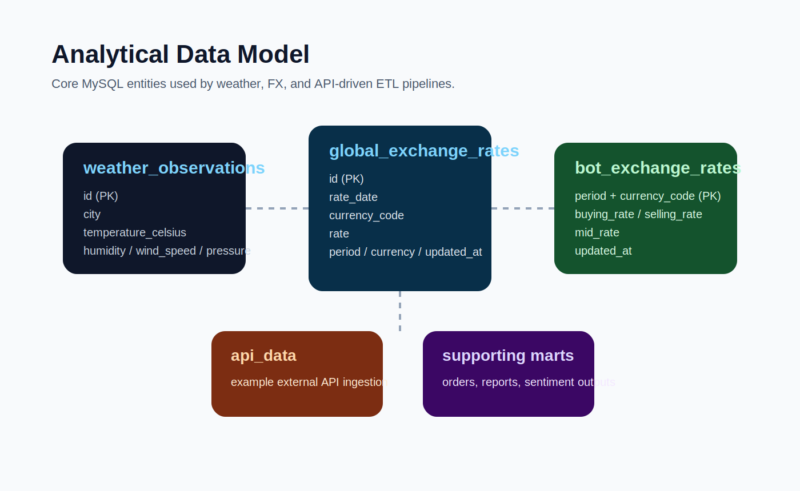
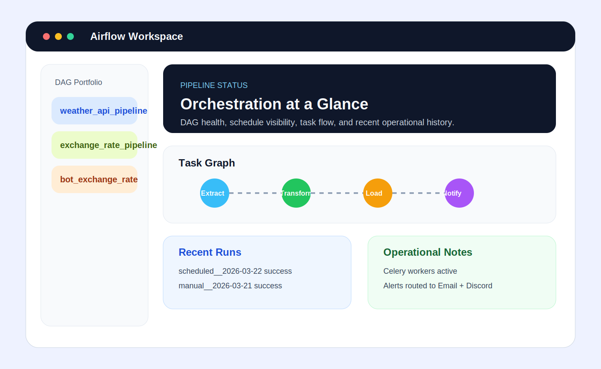
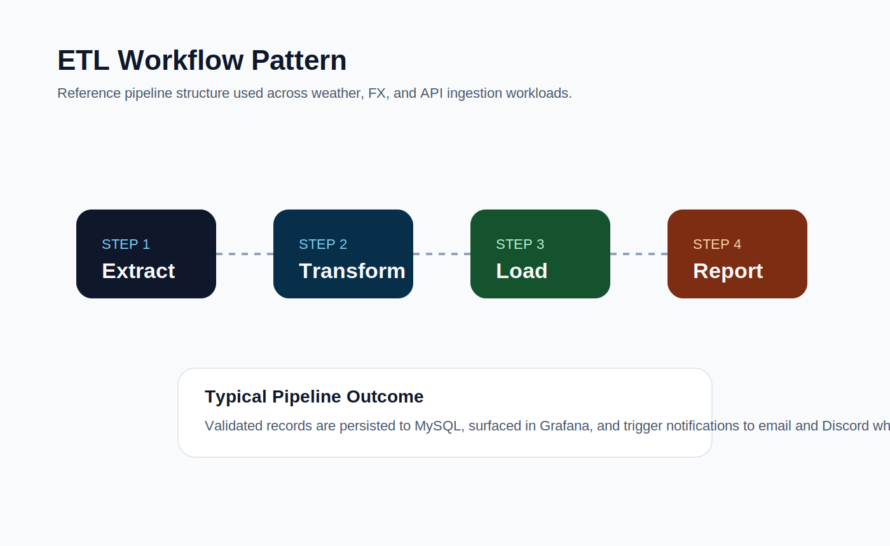

# Data Engineering Pipeline Platform with Apache Airflow

A production-style data engineering platform built with Apache Airflow and Docker.

This project demonstrates how to design, orchestrate, monitor, and test scalable ETL pipelines using modern data engineering practices including CI/CD, data quality validation, monitoring dashboards, automated provisioning, and production-style observability.


---

# System Architecture

The platform processes data from multiple sources including CSV files and external APIs.
Apache Airflow orchestrates ETL pipelines which transform and load data into MySQL while providing monitoring and alerting capabilities.



## Architecture Layers

### 1. Data Sources

- CSV datasets
- External APIs
- Financial exchange rate APIs

### 2. Ingestion Layer

Located in:

```
dags/ingestion/
```

Responsible for loading raw datasets into the system.

Examples:

- CSV ingestion
- API data ingestion

### 3. Processing Layer

Located in:

```
dags/pipelines/
```

Contains business pipelines such as:

- Exchange rate analytics
- Thailand weather intelligence pipeline
- COVID-19 dataset processing
- Customer review sentiment analysis
- E-commerce analytics pipeline
- FX anomaly detection

### 4. Storage Layer

- MySQL → analytical datasets
- PostgreSQL → Airflow metadata

### 5. Observability Layer

- Curated Grafana portfolio
- Discord alert notifications
- Airflow monitoring UI

---

# Data Model

Entity relationships are defined in the ER diagram.



---

# Airflow DAG Architecture

Airflow DAGs are organized into multiple logical groups.

```
dags/
├── ingestion
├── pipelines
└── utils
```

### Ingestion DAGs

```
csv_to_mysql.py
etl_api_pipeline.py
```

Purpose:

- Load raw datasets
- Normalize schema
- Store raw data

### Pipeline DAGs

Examples:

- exchange_rate_pipeline
- ecommerce_full_pipeline
- customer_review_sentiment_pipeline
- covid19_data_pipeline
- bot_exchange_rate_pipeline

Each pipeline follows the ETL structure:

```
Extract
   ↓
Transform
   ↓
Load
   ↓
Reporting / Alerts
```

### Utility Modules

Reusable components for pipelines.

Located in:

```
dags/utils/
```

Examples include:

- API clients
- database manager
- data quality validation
- anomaly detection
- schema management
- reporting utilities

---

# Project Structure

```
├── dags
│   ├── ingestion
│   ├── pipelines
│   ├── templates
│   └── utils
│
├── data
│   ├── people.csv
│   └── raw_customer_reviews.csv
│
├── docker
│   ├── airflow
│   └── mysql
│       └── migrations
│
├── grafana
│   ├── dashboards
│   │   └── curated
│   ├── provisioning
│   └── queries
│
├── scripts
│   └── init_airflow.sh
│
├── tests
│   ├── test_data_quality.py
│   └── test_fx_pipeline.py
│
├── .github/workflows
│   └── airflow-ci.yml
│
├── .local
│   └── ...
│
├── docker-compose.yaml
├── requirements.txt
├── Makefile
├── README.md
```

---

# Environment Setup

Copy the environment template.

```
cp .env.example .env
```

Edit the environment variables if needed.

Example variables include:

```
POSTGRES_USER
MYSQL_USER
BOT_API_KEY
DISCORD_WEBHOOK
OPENWEATHER_API_KEY
WEATHER_CITIES
WEATHER_ALERT_EMAIL
GRAFANA_RENDERING_AUTH_TOKEN
```

---

# Running the Platform

Start the platform using Docker Compose.

```
make up
```

or

```
docker compose up -d --build
```

Stop services

```
make down
```

View logs

```
make logs
```

---

# Access Services

Airflow Web UI

```
http://localhost:8080
```

Default credentials:

```
username: admin
password: admin
```

Grafana Dashboard

```
http://localhost:3000
```

Default credentials:

```
username: admin
password: admin123
```

---

# Airflow Initialization

Airflow initialization tasks are automated using:

```
scripts/init_airflow.sh
```

The script automatically:

- Runs database migrations
- Creates the admin user
- Configures database connections
- Registers Airflow variables including weather pipeline settings

---

# Monitoring & Observability

Pipeline metrics and analytics are visualized through a curated Grafana portfolio with automatic datasource and dashboard provisioning.

Located in:

```
grafana/dashboards/curated/
```

Provisioning files:

```
grafana/provisioning/
```

## Container Console Policy

This stack uses a production-oriented shell policy instead of requiring every container to expose an interactive console.

Principles:

- custom application containers may include a shell for operational debugging
- third-party infrastructure containers should stay lean unless there is a strong operational reason to customize them
- Portainer console access depends on the shell that exists inside the target container image
- `latest` tags should not be used in production because local and server deployments may resolve to different image builds

### Shell Access By Service

`Debuggable by default`

- `airflow-init`
- `webserver`
- `scheduler`
- `worker`
- `triggerer`
- `flower`

Policy:

- these services all come from the custom Airflow image in `docker/airflow/Dockerfile`
- they should always provide at least `/bin/sh`
- `bash` is acceptable here because these are the containers most likely to need package, env var, DAG, and filesystem debugging

`Lean with optional shell`

- `grafana`
- `portainer`
- `mailhog`

Policy:

- keep the upstream image unless there is a clear support burden that justifies customization
- do not add `bash` only for convenience
- use logs and service-specific UIs first, then console access only when the upstream image already supports it

`Keep lean`

- `postgres`
- `mysql`
- `redis`
- `renderer`
- `loki`
- `promtail`

Policy:

- do not rebuild these vendor images just to add shell tooling
- prefer logs, health checks, metrics, and service-native clients for diagnostics
- if deeper debugging is required, use a temporary debug container on the same Docker network instead of mutating the production image

### Operational Guidance

- for app debugging, use the Airflow containers first
- for infrastructure debugging, prefer logs and vendor tools over shell access
- if Portainer console fails with `exec: "bash": executable file not found in $PATH`, retry with `sh` or `/bin/sh`
- if a container has no shell at all, treat that as expected for a lean production image and use a debug sidecar workflow instead
- pin image tags or digests for production deployments so local and server behavior stay aligned

This policy keeps the Airflow application tier easy to operate while preserving a leaner and safer posture for the infrastructure tier.

For rollout order and debug sidecar examples, see `docs/operations_runbook.md`.

## Server Deployment Checklist

Use this short checklist before and after deploying on the server.

Before deploy:

- confirm the target branch and `.env` values are correct for the server
- review `docker-compose.yaml` for image tag changes and mounted path changes
- run `docker compose config` to validate the rendered configuration
- run `docker compose pull` for pinned upstream images
- run `docker compose build airflow-init webserver scheduler worker triggerer flower` if the Airflow image or Python dependencies changed

Deploy order:

- update observability services first: `renderer`, `loki`, `promtail`, `grafana`, `portainer`, `mailhog`
- restart `postgres`, `mysql`, or `redis` only if their image or config changed
- run `docker compose up airflow-init` when bootstrap logic or the Airflow image changed
- refresh the Airflow app tier in this order: `webserver`, `scheduler`, then `worker`, `triggerer`, `flower`

After deploy:

- run `docker compose ps`
- review recent logs for `webserver`, `scheduler`, `worker`, `grafana`, and `portainer`
- verify Airflow UI, Grafana, and Portainer are reachable from the server entrypoints
- confirm there are no restart loops or failed health checks

Quick command set:

```bash
docker compose config && \
docker compose pull && \
docker compose build airflow-init webserver scheduler worker triggerer flower && \
docker compose up -d renderer loki promtail grafana portainer mailhog && \
docker compose up airflow-init && \
docker compose up -d webserver && \
docker compose up -d scheduler && \
docker compose up -d worker triggerer flower && \
docker compose ps && \
docker compose logs --tail=50 webserver scheduler worker grafana portainer
```

If there are no image, dependency, or bootstrap changes, you can skip the `build` step and the `airflow-init` step.

## Grafana Portfolio

The production portfolio is intentionally curated into a focused set of dashboards so the workspace stays clean, opinionated, and easy to operate.


### 1. Atlas Executive Command Center

Purpose:

- default Grafana landing page
- cross-domain executive summary for weather, FX, and platform health
- fast province filter for Thailand weather drill-down
- drill-down navigation into specialized dashboards

Primary audience:

- engineering leads
- operations managers
- demo / stakeholder reviews

### 2. Atmospheric Operations Suite

Purpose:

- monitor live province-level weather conditions loaded by the Airflow weather pipeline
- track temperature, feels-like conditions, humidity, wind, pressure, and recent observations
- support operational review of incoming Thailand weather records

Primary audience:

- data engineers validating weather ingestion
- operations users monitoring province conditions

### 3. Thailand Weather Overview

Purpose:

- provide a nationwide view of latest weather conditions across provinces
- compare hottest, coolest, and most humid provinces at a glance
- support executive review without opening the province detail board

Primary audience:

- stakeholders
- operations leads
- demo walkthroughs

### 4. Thailand Regional Heat Ranking

Purpose:

- group provinces by region such as North, Northeast, Central, East, West, and South
- rank temperatures and humidity within each region
- make countrywide weather monitoring easier for non-technical users

Primary audience:

- operations teams
- analysts
- anyone reviewing national weather patterns

### 5. Global FX Intelligence Suite

Purpose:

- monitor exchange rate snapshots and recent currency movements
- provide a focused market overview without the clutter of older experimental dashboards
- serve as the production FX board for the platform

Primary audience:

- analysts
- product demos
- finance-oriented pipeline reviews

### 6. Platform Reliability Center

Purpose:

- centralize logs and runtime visibility through Loki
- support troubleshooting, incident review, and operational diagnostics
- complement Airflow UI with platform-level observability

Primary audience:

- operators
- platform engineers
- anyone debugging pipeline runtime issues

## Dashboard Lifecycle

The dashboard repository is organized into two groups:

```
grafana/dashboards/curated/
```

Contains the dashboards that Grafana auto-loads in production.

```
.local/
```

Contains local-only archives and reference assets that are intentionally excluded from the production dashboard set.

## Portfolio Characteristics

- dashboards are provisioned automatically at startup
- MySQL and Loki datasources are provisioned automatically
- Grafana opens directly to the executive landing dashboard
- curated dashboards are cross-linked for clean navigation
- local archives are kept outside the production dashboard path
- provisioned dashboards allow UI edits, but repo files must still be synced manually

## Grafana UI Sync Workflow

Use this workflow when you want to fine-tune a provisioned dashboard in Grafana UI and then bring the final version back into the repository.

### 1. Edit and save in Grafana UI

- open the provisioned dashboard
- make your layout, query, and panel changes in Grafana
- click `Save dashboard`

### 2. Export the dashboard JSON from Grafana

- open the saved dashboard
- choose `Share` or `Export`
- download the dashboard JSON to your machine

### 3. Sync the exported JSON back into the repo

Use the helper script below. It accepts either:

- a raw dashboard export from Grafana UI
- an API-style export that wraps the dashboard under `dashboard`

```bash
bash scripts/sync_grafana_dashboard.sh \
  ~/Downloads/Thailand_Weather_Overview.json \
  grafana/dashboards/curated/05_Thailand_Weather_Overview.json
```

### 4. Validate and commit

```bash
python3 -m json.tool grafana/dashboards/curated/05_Thailand_Weather_Overview.json >/dev/null
git add grafana/dashboards/curated/05_Thailand_Weather_Overview.json
git commit -m "chore: sync grafana dashboard changes from ui export"
```

### 5. Redeploy Grafana

```bash
docker compose restart grafana
```

This keeps the UI convenient for fast iteration while preserving the repository as the source of truth for the provisioned dashboard files.

## Portfolio Branding

The curated dashboards are positioned as a lightweight enterprise analytics package:

- `Atlas Executive Command Center`
- `Atmospheric Operations Suite`
- `Thailand Weather Overview`
- `Thailand Regional Heat Ranking`
- `Global FX Intelligence Suite`
- `Platform Reliability Center`

This naming convention makes the monitoring layer read more like a product portfolio than a folder of unrelated Grafana files.

Example Airflow UI:



---

# Data Quality Validation

The platform includes built-in data quality validation.

Located in:

```
dags/utils/data_quality.py
```

Validation checks include:

- Null detection
- Duplicate detection
- Schema validation
- FX anomaly detection

Example usage:

```
from utils.data_quality import validate_dataset

validate_dataset(dataframe)
```

---

# Testing

Automated tests are implemented using pytest.

Test directory:

```
tests/
```

Run tests locally:

```
make test
```

or

```
pytest tests/
```

Test coverage includes:

- data quality checks
- FX analytics pipelines
- transformation logic

---

# CI/CD Pipeline

Continuous integration and deployment is handled via GitHub Actions.

Workflow file:

```
.github/workflows/airflow-ci.yml
```

CI pipeline steps:

1. Install dependencies
2. Run automated tests
3. Deploy to GCP VM via SSH
4. Rebuild Docker containers

Deployment command executed on the server:

```
docker compose down
docker compose up -d --build
```

---

# Example ETL Workflow

The following diagram illustrates the end-to-end ETL workflow orchestrated by Apache Airflow.



Typical pipeline execution:

```
Extract API / CSV Data
      ↓
Transform Data
      ↓
Validate Data Quality
      ↓
Load into MySQL
      ↓
Generate Reports
      ↓
Send Alerts
```

---

# Weather Pipeline

The weather pipeline ingests Thailand province-level weather data from OpenWeather, stores observations in MySQL, and pushes notifications to Discord and email.

Key behavior:

- reads `OPENWEATHER_API_KEY` from Airflow Variables or environment variables
- reads `WEATHER_CITIES` as a comma-separated override list
- defaults to a built-in Thailand province list when `WEATHER_CITIES` is empty
- writes weather data into `weather_observations`
- supports province and region analytics for Grafana dashboards

Schema source of truth:

```
docker/mysql/init.sql
```

The Airflow DAG no longer creates `weather_observations`. It only inserts and updates records.

For existing environments with an older MySQL volume, run the migration below before executing the updated weather DAG:

```
docker/mysql/migrations/001_weather_observations_region_upgrade.sql
```

## Production Migration Runbook

Use this only on environments that already have a `weather_observations` table from an older schema.

### 1. Back up the table

```bash
docker compose exec -T mysql sh -lc 'ts=$(date +%Y%m%d_%H%M%S); mysql -uroot -p"$MYSQL_ROOT_PASSWORD" "$MYSQL_DATABASE" -e "CREATE TABLE weather_observations_backup_${ts} LIKE weather_observations; INSERT INTO weather_observations_backup_${ts} SELECT * FROM weather_observations; SHOW TABLES LIKE '\''weather_observations_backup_%'\'';"'
```

### 2. Run the migration

```bash
docker compose up -d mysql
docker compose exec -T mysql sh -lc 'mysql -uroot -p"$MYSQL_ROOT_PASSWORD" "$MYSQL_DATABASE"' < docker/mysql/migrations/001_weather_observations_region_upgrade.sql
```

### 3. Verify the schema

```bash
docker compose exec -T mysql sh -lc 'mysql -uroot -p"$MYSQL_ROOT_PASSWORD" "$MYSQL_DATABASE" -e "SHOW COLUMNS FROM weather_observations; SHOW INDEX FROM weather_observations;"'
```

### 4. Deploy the refreshed stack

```bash
docker compose up -d --build
```

### 5. Validate new weather records

```bash
docker compose exec -T mysql sh -lc 'mysql -uroot -p"$MYSQL_ROOT_PASSWORD" "$MYSQL_DATABASE" -e "SELECT province, region, city, observed_at_local FROM weather_observations ORDER BY observed_at_local DESC LIMIT 10;"'
```

### 6. Optional rollback pattern

Replace `YYYYMMDD_HHMMSS` with the backup suffix created in step 1.

```bash
docker compose exec -T mysql sh -lc 'mysql -uroot -p"$MYSQL_ROOT_PASSWORD" "$MYSQL_DATABASE" -e "DROP TABLE weather_observations; RENAME TABLE weather_observations_backup_YYYYMMDD_HHMMSS TO weather_observations;"'
```

---

# Technologies Used

Core stack:

- Apache Airflow
- Docker
- MySQL
- PostgreSQL
- Grafana
- Loki

Python ecosystem:

- Pandas
- Requests
- Pytest

Infrastructure:

- Docker Compose
- GitHub Actions
- GCP Virtual Machine
- Grafana provisioning

---

# Future Improvements

Potential enhancements:

- Kubernetes deployment
- dbt integration
- data warehouse layer
- advanced anomaly detection
- Slack / PagerDuty alerts

---

# License

MIT License
